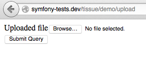
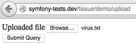
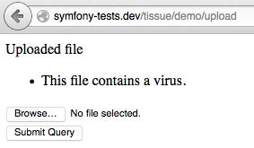

# TissueBundle 

A Symfony bundle that can scan your files for viruses using the [Tissue](https://github.com/cleentfaar/tissue) library and adapters.

 

### Features

- Scan uploaded files during validation (using the `CleanFile` constraint).
- Scan files during a batch process (simply using the `cl_tissue.scanner`-service).
- Uses the [Tissue](https://github.com/cleentfaar/tissue) library and it's `ClamAV` adapter, but you can easily add your
own adapters by tagging them with `cl_tissue.adapter`, see the [installation documentation](Resources/doc/installation.md)
for more information.

### Quick example

...pictures say more than a thousand words right?

**1. You have a file-upload form...**

**2. Someone tries to upload an infected file...**

**3. The infected file gets rejected...**

### Documentation

- [Installation](Resources/doc/installation.md)
- [Usage](Resources/doc/usage.md)

### WARNING

**I highly recommend you to research the security issues involved before using any of these packages on a production server!**

Although following the steps described in the documentation should be enough to keep most evil-doers from uploading infected
files to your forms, I can never give any 100% guarantee! You should take care in keeping your virus-scanner's signature
database up-to-date, otherwise new viruses may get through. You should also keep in mind that there are many more ways to
abuse uploads than just uploading an infected file!

**Make sure your application cannot be manipulated to execute any of the uploaded files! Not even those deemed 'clean'!**

For instance, if you were to keep files available on your web-directory after they have been uploaded, you better
make sure that there is **NO CHANCE** that the file may get executed by your application in one way or another.

A malicious user could simply upload a piece of PHP-code (no virus!) that will open your application up to a huge range
of leaks. Again, that's just one of the reasons that you should not solely rely on this package protecting your site!

Read up on this subject before opening up your application to possible security leaks! **I am not responsible for
any damage done to your server or application while using this package!**
